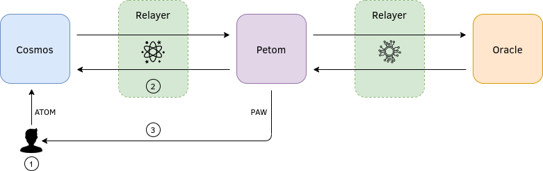

# GoZ Research

## Architecture Overview

1. User deposits ATOM from the `cosmoshub` into the `petomhub` via IBC
2. User locks up ATOM as collateral on the `petomhub`
3. User receives PAW from the `petomhub`, exchanged at the spot price of ATOM/PAW fed from an oracle

## Task List
### General
- [x] Spin up the `petomhub` (using gaia for now)
- [x] Set up a relayer between another chain (e.g. Gaia) and the `petomhub`
- [x] Connect the two chains
- [x] Transfer tokens back and forth between the two chains
- [ ] Automate the process of establishing new connections (in progress)
- [ ] Test packet connections
- [ ] Test packet relay
- [ ] More

### Infrastructure
- [ ] Audit with Lynis (in progress)
- [x] Whitelist `35.230.14.56`, `34.82.233.123` and `34.83.182.199` for port `26657`

## Key Points
- Chain restart due to any reason (e.g. software crash, lack of funds) would be considered a fail. This is because the relayer light client wouldn't sync anymore if the chain went down.
- It's recommended to run multiple relayers to maximize connection counts, BUT this also increases your chances of losing points due to relayers going down.
- If the zone you were connected went down, you'd need to delete the old light client you created for that chain and initiate a new one.

## Weekly Challenges
- Week 1 - Pushes the limits of packet connections by maintaining the longest lived connection with the fewest packets sent
- Week 2 - Relay as many packets as possible with its relayer key
- Week 3 - Execute the best confusion or deception attacks against other zones

## Cumulative Contest Challenge Rewards
- Most Packets Relayed via IBC module
  - the team that invests in automation to relay more packets than any other team throughout the entire competition
- Best Custom Zone
  - the team that invests beta tests their custom zone designed to be part of the network when IBC is production-ready
- Most Creative Zone
  - the team with the most creative use for IBC-generated tokens used in novel ways
- Most Innovative/Deceptive State Machine
  - the team who pulls off the best deception attacks by configuring their state machine in ways that give them significant benefits throughout the competition
- The Gaia Award
  - the team that creates the best content and technical write ups that share best practices and document novel implementations for the community throughout the competition
  
## Important Links
- [Official GoZ Repo](https://github.com/cosmosdevs/GameOfZones)
- [Scope](https://goz.cosmosnetwork.dev/)
- [Updates](https://goz.cosmosnetwork.dev/blog-2/)
- [AMA](https://www.youtube.com/watch?v=_uEu1Yfd2sY)

## Instructions
Click [here](https://www.notion.so/jim380/GoZ-petomhub-c197bae889f64e189dfc1f7e6c93506e)

## Resources
- [IBC Specs](https://github.com/cosmos/ics)
- [Gaia](https://github.com/cosmos/gaia/tree/ibc-alpha)
- [Relayer](https://github.com/iqlusioninc/relayer)
- [IBC Video Demo](https://youtu.be/S6DKib4jINk)
- [Cosmos SDK Docs](https://docs.cosmos.network/)
- [Tendermint Docs](https://docs.tendermint.com/)
- [More](https://gist.github.com/lovincyrus/6d9e1f79102379e5cb935158fa0ba05a)
